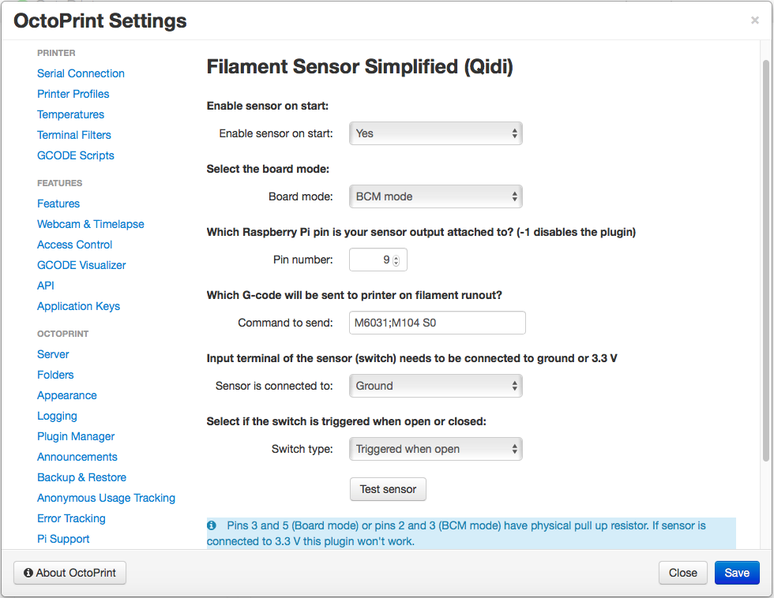

# Filament sensor simplified (Qidi)

This branch of Lukáš Malatinský's (LuckyX182) excellent Filament_sensor_simplified adds support for Qidi X-Plus and X-Max printers where print jobs are sent from Qidi's slicer and not from Octoprint. This modification has been tested with TriangleLab Filament Runout Sensor Detector (https://www.amazon.com/gp/product/B07DHD8WHF/ref=ppx_yo_dt_b_asin_title_o05_s00?ie=UTF8&psc=1).

Additional instructions can be found at https://github.com/luckyx182/Filament_sensor_simplified/

## Screenshots

Plugin settings:

